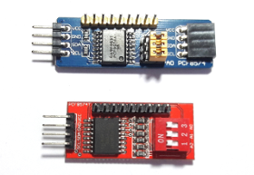

# PCF8574

A MakeCode-PXT extension for the PCF8574(AT) I2C device which can be used an 8-bit I/O expander.

## Wiring

Pins (PCF8574 module <--> Microbit Edge Connector)
- Vcc: 3V pin (3.3V)
- SCL: Pin 19
- SDA: Pin 20
- Gnd: Gnd pin (0V)

## License

MIT

## Supported Targets

* for PXT/microbit

## Acknowledgement

Thank to IoT Engineering Education @ KMUTNB
[https://www.facebook.com/iot.kmutnb/](https://www.facebook.com/iot.kmutnb/)

## Update

2019-Feb-18

